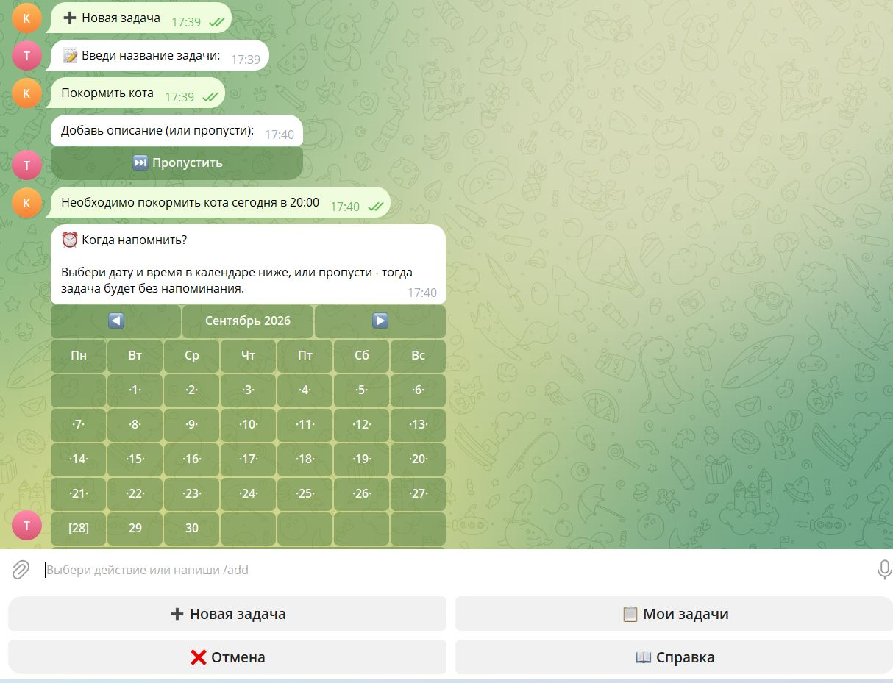
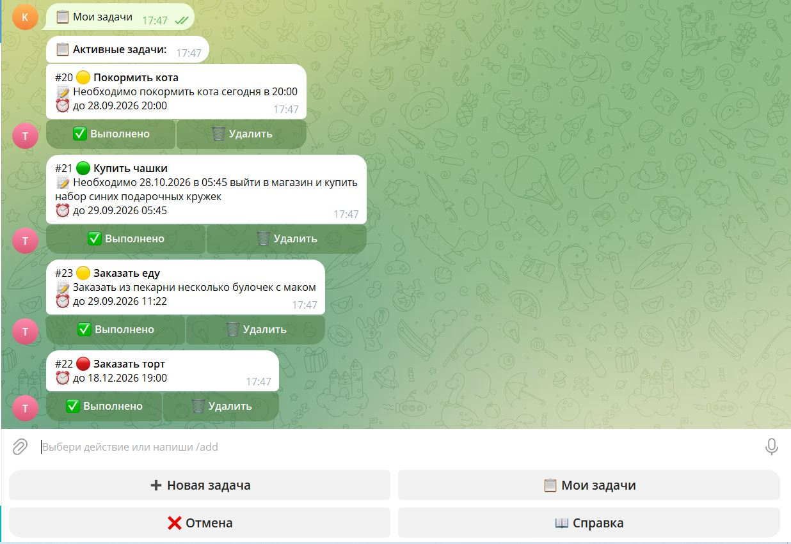
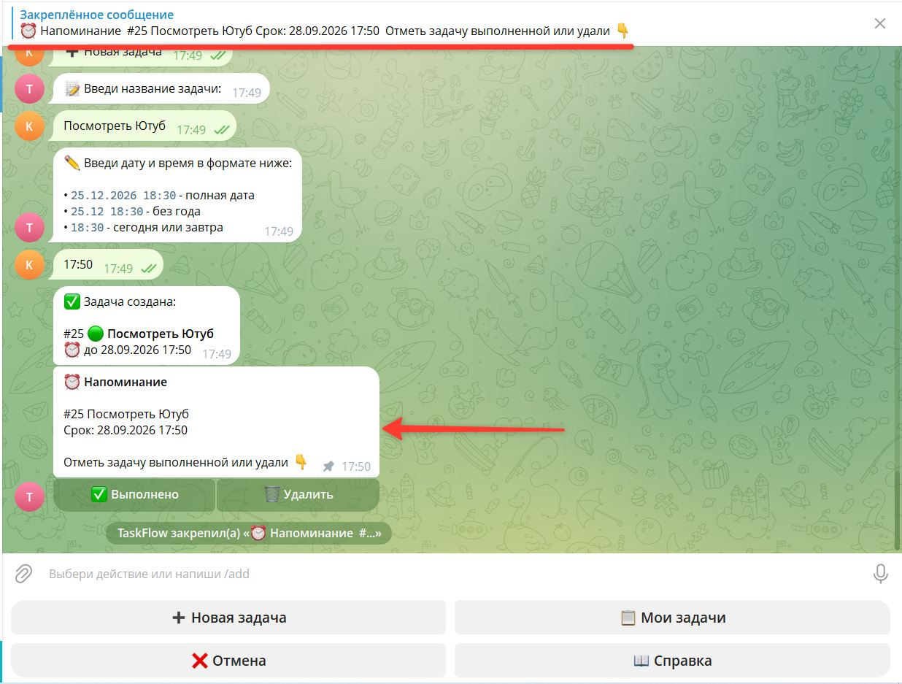
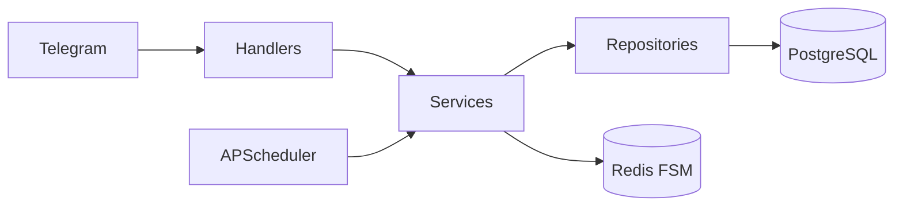

# TaskFlow Bot

[](https://github.com/Vlad77-rmb/TaskFlow_bot/actions/workflows/ci.yml)


Telegram-бот - менеджер задач с напоминаниями на **aiogram 3**.

Создавай задачи, ставь дедлайны через инлайн-календарь, получай напоминания с кнопками прямо в чате.

## Скриншоты

| Календарь | Список задач | Напоминание |
|-----------|--------------|-------------|
|  |  |  |

## Что реализовано

- ✅ Создание задач: название, описание, приоритет, дедлайн
- ✅ Инлайн-календарь + выбор времени (шаги 30 мин)
- ✅ Ручной ввод даты: `25.12.2026 18:30`, `25.12 18:30`, `18:30`
- ✅ Напоминания через APScheduler с закреплением в чате
- ✅ Кнопки ✅/🗑 прямо в напоминании
- ✅ FSM в Redis (состояния переживают рестарт)
- ✅ Валидация прошедших дат и времени
- ✅ Постоянное reply-меню
- ✅ 17 unit-тестов + CI (ruff, mypy, pytest)
- ✅ Docker + docker-compose

## Стек

- **aiogram 3.x** - Telegram Bot API
- **SQLAlchemy 2.0 (async)** + **PostgreSQL** - данные
- **Alembic** - миграции
- **Redis** - FSM-хранилище
- **APScheduler** - напоминания
- **Docker / docker-compose** - деплой
- **pytest / ruff / mypy** - качество

## Архитектура



**Слоистая архитектура.** Хендлеры не знают про SQL, репозитории не знают про Telegram. Поток: `handler → service → repository → DB`.

## Структура проекта

```
taskflow-bot/
├── src/
│   ├── bot/
│   │   ├── handlers/      # роутеры
│   │   ├── keyboards/     # reply + inline клавиатуры
│   │   ├── middlewares/   # DB session
│   │   └── states/        # FSM
│   ├── services/          # бизнес-логика
│   ├── db/                # модели, репозитории
│   ├── core/              # config, logging
│   └── main.py
├── alembic/               # миграции
├── tests/                 # pytest
└── docker-compose.yml
```

## Быстрый старт

```bash
git clone https://github.com/Vlad77-rmb/TaskFlow_bot.git
cd TaskFlow_bot
cp .env.example .env
# вставь BOT_TOKEN из @BotFather
docker compose up --build
```

## Команды бота

| Команда | Описание |
|---------|----------|
| `/start` | Регистрация |
| `/add` | Создать задачу |
| `/list` | Активные задачи |
| `/done <id>` | Завершить |
| `/delete <id>` | Удалить |
| `/cancel` | Отменить текущее действие |
| `/help` | Справка |

## Разработка

```bash
pip install -e ".[dev]"
pytest -v
ruff check src tests
mypy src
```
