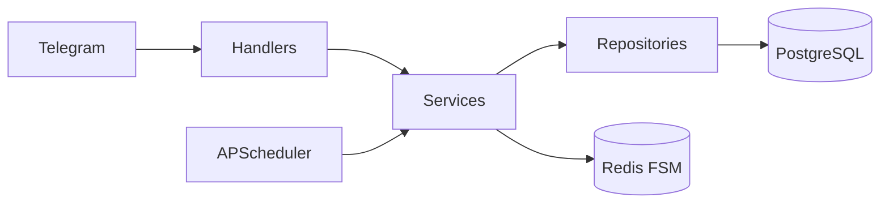

# TaskFlow Bot

[](https://github.com/Vlad77-rmb/TaskFlow_bot/actions/workflows/ci.yml)

Telegram-бот - менеджер задач с напоминаниями на aiogram 3.

## Стек

- **aiogram 3.x** - Telegram Bot API
- **SQLAlchemy 2.0 (async)** + **PostgreSQL** - данные
- **Alembic** - миграции
- **Redis** - FSM-хранилище
- **APScheduler** - напоминания
- **Docker / docker-compose** - деплой
- **pytest / ruff / mypy** - качество

## Архитектура



## Быстрый старт

```bash
git clone https://github.com/<you>/taskflow-bot
cd taskflow-bot
cp .env.example .env
# вставь BOT_TOKEN
docker compose up --build
```

## Команды бота

| Команда | Описание |
|---------|----------|
| `/start` | Регистрация |
| `/add` | Создать задачу |
| `/list` | Активные задачи |
| `/done <id>` | Завершить |
| `/delete <id>` | Удалить |
| `/cancel` | Отменить |

## Разработка

```bash
pip install -e ".[dev]"
pytest -v
ruff check src tests
mypy src
```

## Roadmap

- [ ] Теги и фильтры
- [ ] Повторяющиеся задачи
- [ ] i18n (RU/EN)
- [ ] Вебхуки + FastAPI
